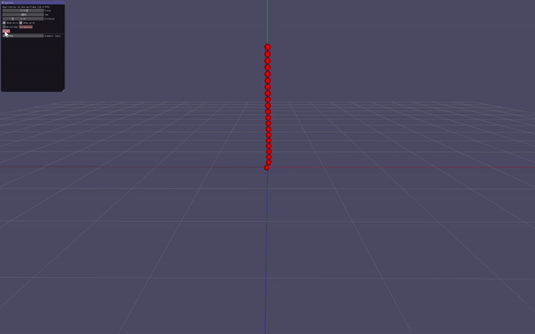

# CGRA OpenGL Project - A Simple Position Based Dynamics Simulation

# Requirements

The project requires [CMake](https://cmake.org/) to build before compiling. The recommended way to build to project is to create a build folder then using CMake to create to project inside it. Make sure that you are creating the build folder in the same directory as the work folder.
```sh
$ mkdir build
```

This project also requires OpenGL v3.3 and a suitable C++11 compiler.


## Linux

#### Command Line

The simpliest way to set up a basic project is to run the shell script `runcmake.sh` (`runcmake.bat` for Windows) which runs the `cmake`, `make` and run commands for you.
```sh
$ ./runcmake.sh
```

Alternativiely you can run the commands manually.
```sh
$ cd build
$ cmake ../work
$ make
$ cd ..
```

If the project builds without errors the executable should be located in the `build/bin/` directory and can be run with:
```sh
$ ./build/bin/base [args...]
```

#### Eclipse
Setting up for [Eclipse](https://eclipse.org/) is a little more complicated. Navigate to the build folder and run `cmake` for Eclipse.
```sh
$ cd build
$ cmake  -G "Eclipse  CDT4 - Unix  Makefiles" ../work
```
Start Eclipse and go to `File > Import > Existing Projects into Workspace`, browse to and select the `build/` directory as the project. Make sure  the  box `Copy  Projects into Workspace` is unchecked. Once you've imported the project, and are unable run it, do the following:
 - Go to `Run > Run  Configurations`.  On the left side, select C/C++  Application, then in the `Main` tab, make sure your C/C++ Application field contains `./bin/base` and that `Enable auto build` is checked.
 - On your project, `[right click] > Run As > C/C++  Application`.  This should setup the default way to start the program, so you can simply run the project anytime after that.

If  you  need  to  run  with  arguments  (and  you  will  with  some  projects)  go  to `Run > Run Configurations > Arguments` and enter your arguments there.  For example: `./work/res/assets/teapot.obj `


## Windows

#### Visual Studio

This project requires at least Visual Studio 2017. You can get the latest, [Visual Studio Community 2017](https://www.visualstudio.com/downloads/), for free from Microsoft.

| Product |  XX  |
|:-------:|:----:|
| Visual Studio 2017 | 15 |

Run the `cmake` command for Visual Studio with the appropriate version number (XX).
```sh
> cmake -G "Visual Studio XX" ..\work
```

Or if you are building for 64-bit systems.
```sh
> cmake -G "Visual Studio XX Win64" ..\work
```

After opening the solution (`.sln`) you will need to set some additional variables before running.
 - `Solution Explorer > base > [right click] > Set as StartUp Project`
 - `Solution Explorer > base > [right click] > Properties > Configuration Properties > Debugging`
    - Select `All Configurations` from the configuration drop-down
    - Set `Working Directory` to `(SolutionDir)../work`
    - Set `Command Arguments` to whatever is required by your program


## OSX

#### XCode

[Xcode](https://developer.apple.com/xcode/) is an IDE that offers a little more than simple text editing. The setup again is very similar to Eclipse.
```sh
$ cd build
$ cmake -G "Xcode" ../work
$ cd ..
```

Once you're setup, you can build your project with Xcode, but have to execute your program with the terminal (making sure you are in the root directory).
```sh
$ ./build/bin/base [args..]
```


# CGRA Library

In addition to the math library and other external libraries, this project provides some simple classes and functions (in the `cgra` namespace) to get started with a graphics application. Further description and documentation can be found in the respective headers.

| File | Description |
|:----:|:------------|
| `cgra_geometry.hpp` | Utility functions for drawing basic geometry like spheres |
| `cgra_gui.hpp` | Provides methods for setting up and rendering ImGui  |
| `cgra_image.hpp` | An image class that can loaded from and saved to a file |
| `cgra_mesh.hpp` | Mesh builder class for simple position/normal/uvs meshes |
| `cgra_shader.hpp` | Shader builder class for compiling shaders from files or strings |
| `cgra_wavefront.hpp` | Minimum viable wavefront asset loader function that returns a `mesh_builder` |

In particular, the `rgba_image`, `shader_builder`, and `mesh_builder` classes are designed to hold data on the CPU and provide a way to upload this data to OpenGL. They are not responsible for deallocating these objects.

# etc

- If you add new source files, put them in \/src, and they would be added to the project automatically based on their extension.
- In VS, for example, don't forget to change the build type to debug (for debugging) or release (fast execution) as needed.
- When submitting your work, only submit your work directory--don't submit the build directory.

